# Firmware Update

## 1 Purpose/Scope

This application demonstrates how to update the SiWx91x firmware via Wi-Fi by downloading an image from a remote TCP server. The TCP server may be hosted on a local PC (as demonstrated in this example), or alternately on a cloud service such as Amazon AWS or Microsoft Azure. The update process works as follows:

- The SiWx91x connects via Wi-Fi as a TCP client to a TCP update server
- The SiWx91x OTA application sends a firmware file request to the server and server responds with the firmware file
- The OTA application programs the firmware into the SiWx91x flash memory and reboots

## 2 Prerequisites/Setup Requirements

### 2.1 Hardware Requirements  

- PC or Mac.
- Linux PC or Cygwin on Windows (to build and run the TCP server source provided)
- Wi-Fi Access point with a connection to the internet
- **SoC Mode**:
  - Silicon Labs [BRD4325A, BRD4325B, BRD4325C, BRD4325G, BRD4338A](https://www.silabs.com/)
- **NCP Mode**:
  - Silicon Labs [BRD4180B](https://www.silabs.com/)
  - Host MCU Eval Kit. This example has been tested with:
    - Silicon Labs [WSTK + EFR32MG21](https://www.silabs.com/development-tools/wireless/efr32xg21-bluetooth-starter-kit)

### 2.2 Software Requirements

- Simplicity Studio IDE 

  - Download the latest [Simplicity Studio IDE](https://www.silabs.com/developers/simplicity-studio)
  - Follow the [Simplicity Studio user guide](https://docs.silabs.com/simplicity-studio-5-users-guide/1.1.0/ss-5-users-guide-getting-started/install-ss-5-and-software#install-ssv5) to install Simplicity Studio IDE
  - Installation of Build tools for Linux including the gcc compiler (or equivalent on PC or Mac)
  - For Ubuntu, use the following command for installation: `user@ubuntu:~$ sudo apt install build-essential`
  - If you don't have Linux, [Cygwin for Windows](https://www.cygwin.com/) may be used instead

### 2.3 Setup Diagram

#### SoC Mode

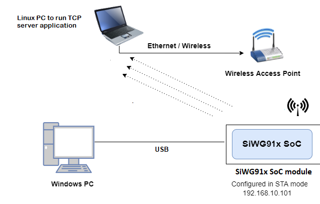

#### NCP Mode  

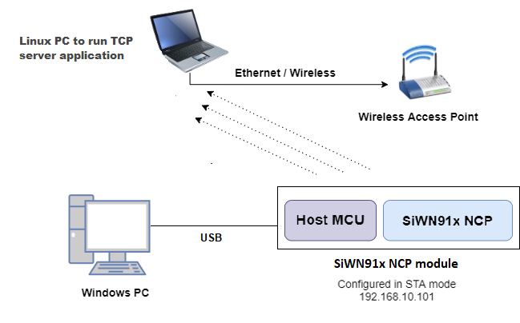

Follow the [Getting Started with Wiseconnect3 SDK](https://docs.silabs.com/wiseconnect/latest/wiseconnect-getting-started/) guide to set up the hardware connections and Simplicity Studio IDE.

**NOTE**:

- The Host MCU platform (EFR32MG21) and the SiWx91x interact with each other through the SPI interface.

## 3 Project Environment

- Ensure the SiWx91x loaded with the latest firmware following the [Upgrade Si91x firmware](https://docs.silabs.com/wiseconnect/latest/wiseconnect-getting-started/getting-started-with-soc-mode#upgrade-si-wx91x-connectivity-firmware)

- Ensure the latest Gecko SDK along with the extension WiSeConnect3 is added to Simplicity Studio.

### 3.1 Creating the project

#### 3.1.1 SoC mode

- Ensure the SiWx91x set up is connected to your PC.

- In the Simplicity Studio IDE, the SiWx91x SoC board will be detected under **Debug Adapters** pane as shown below.

  **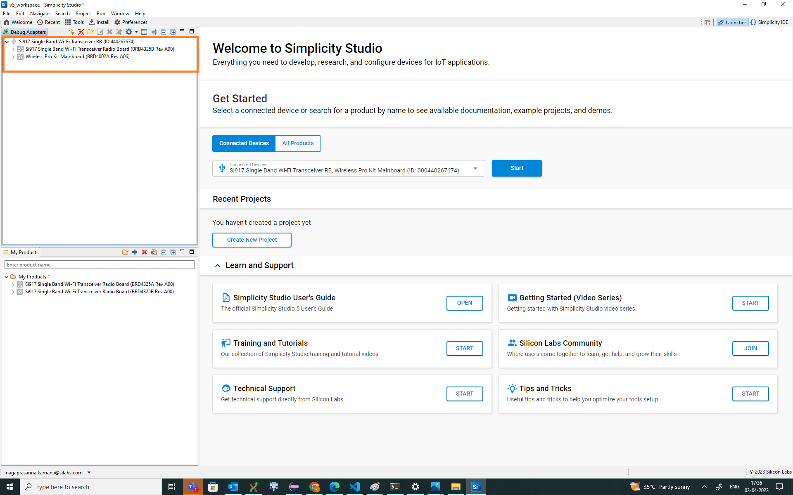**

#### 3.1.2 NCP mode

- Ensure the EFx32 and SiWx91x set up is connected to your PC.

- In the Simplicity Studio IDE, the EFR32 board will be detected under **Debug Adapters** pane as shown below.

  ****

### 3.2 Importing the project

- Studio should detect your board. Your board will be shown here. Click on the board detected and go to **EXAMPLE PROJECTS & DEMOS** section 

#### SOC Mode

- Select **Wi-Fi - Wlan Firmware Update(SOC)** test application

  **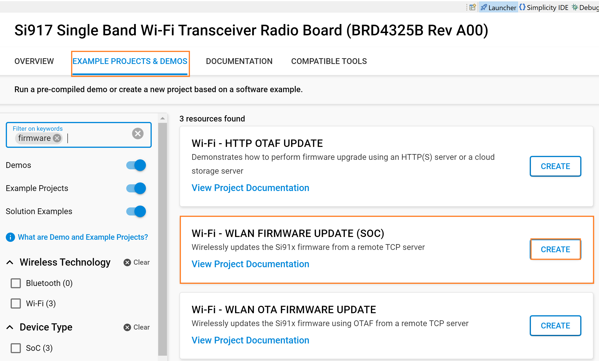**

- Click 'Create'. The "New Project Wizard" window appears. Click 'Finish'

  **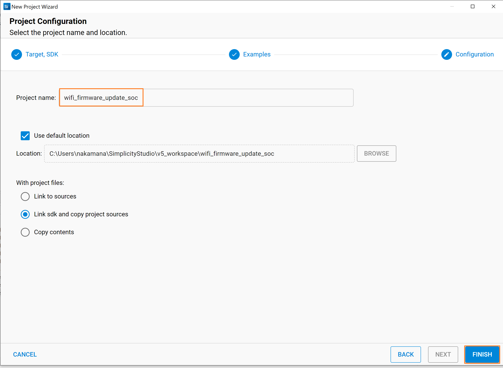**

#### NCP Mode

- Select **Wi-Fi - Wlan Firmware Update(NCP)** test application

  **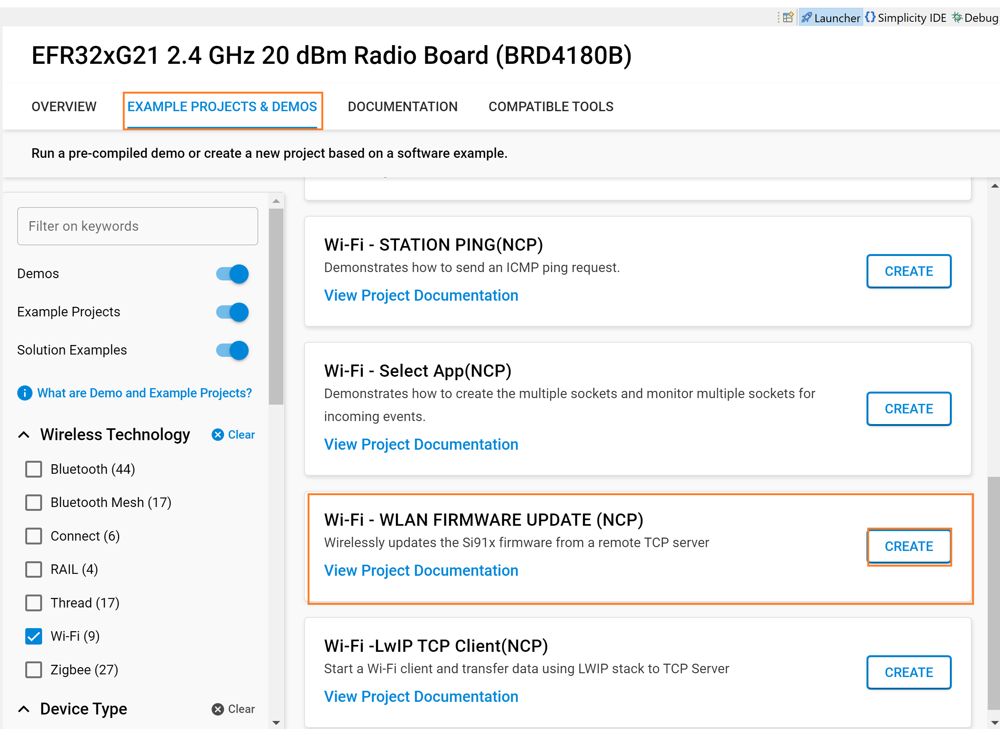**

- Click 'Create'. The "New Project Wizard" window appears. Click 'Finish'

  ****

### 3.3 Set up for application prints

#### 3.3.1 Teraterm set up - for BRD4325A, BRD4325B, BRD4325C, BRD4325G

You can use either of the below USB to UART converters for application prints.

1. Set up using USB to UART converter board.

   - Connect Tx (Pin-6) to P27 on WSTK
   - Connect GND (Pin 8 or 10) to GND on WSTK

   ****

2. Set up using USB to UART converter cable.

   - Connect RX (Pin 5) of TTL convertor to P27 on WSTK
   - Connect GND (Pin1) of TTL convertor to GND on WSTK

   ****

3. Open the Teraterm tool.

   - For SoC mode, choose the serial port to which USB to UART converter is connected and click on **OK**.

     ****

**Note:** For Other 917 SoC boards please refer section #3.3.2

#### 3.3.2 **Teraterm set up - for NCP and SoC modes**

1. Open the Teraterm tool.

- choose the J-Link port and click on **OK**.
    
    ****

2. Navigate to the Setup → Serial port and update the baud rate to **115200** and click on **OK**.

    ****

    ****

## 4 Application Build Environment

The application can be configured to suit your requirements and development environment.

### 4.1.1 In the Project explorer pane, expand the **config** folder and open the **sl_net_default_values.h** file. Configure the following parameters to enable your Silicon Labs Wi-Fi device to connect to your Wi-Fi network

- **STA instance related parameters**

	- DEFAULT_WIFI_CLIENT_PROFILE_SSID refers to the name with which Wi-Fi network that shall be advertised and Si91X module is connected to it.

  	```c
  	#define DEFAULT_WIFI_CLIENT_PROFILE_SSID               "YOUR_AP_SSID"      
  	```

	- DEFAULT_WIFI_CLIENT_CREDENTIAL refers to the secret key if the Access point is configured in WPA-PSK/WPA2-PSK security modes.

  	```c
  	#define DEFAULT_WIFI_CLIENT_CREDENTIAL                 "YOUR_AP_PASSPHRASE" 
  	```

	- DEFAULT_WIFI_CLIENT_SECURITY_TYPE refers to the security type of the Access point. The supported security modes are mentioned in `sl_wifi_security_t`.

  	```c
  	#define DEFAULT_WIFI_CLIENT_SECURITY_TYPE               SL_WIFI_WPA2 
    ```

- Other STA instance configurations can be modified if required in `default_wifi_client_profile` configuration structure.

### 4.1.2 TCP Configuration

```c
#define SERVER_PORT        5001        // TCP server port of the remote TCP server
#define SERVER_IP_ADDRESS  "172.20.10.3"  // Server IP address 
```
### 4.1.3 Combined Image Configuration 

```c
#define COMBINED_IMAGE    0        //Set 1 for combined image upgrade and 0 for TA firmware upgrade
```

### 4.2 Build the application

- SoC mode: Build as Firmware update Example

   **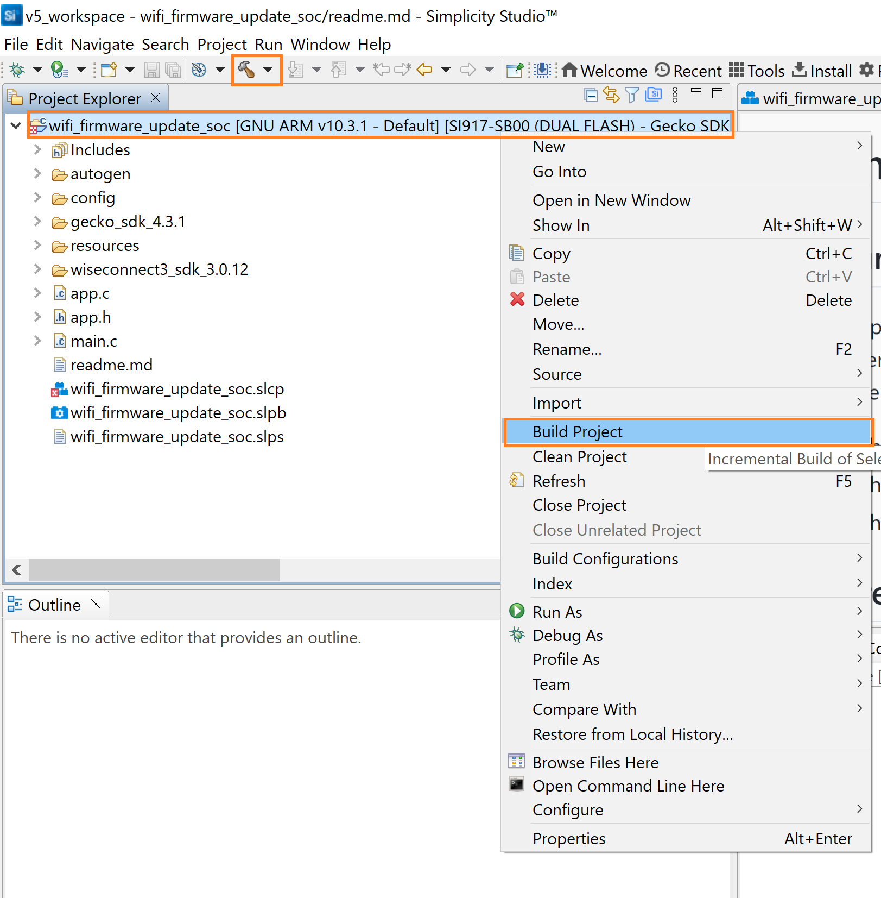**

- NCP mode: Build as Firmware update Example

   **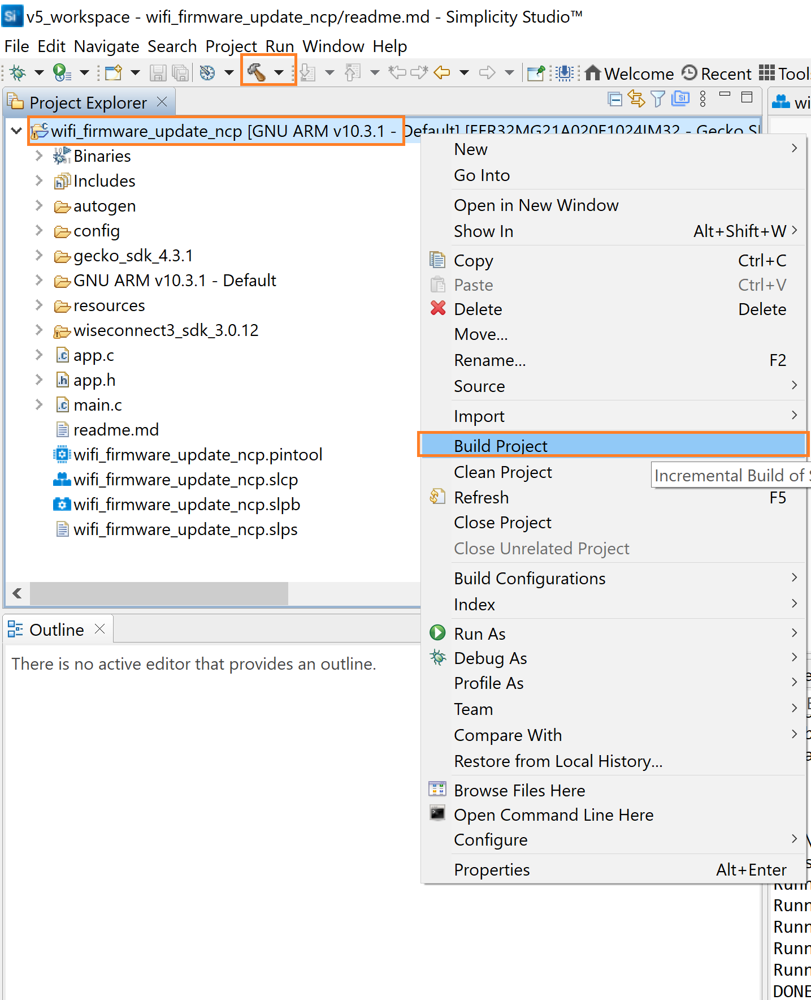**

### 4.3 Run and Test the application

## Build and run the TCP Server

  1. Copy the TCP server application [firmware_update_tcp_server.c](https://github.com/SiliconLabs/wiseconnect-wifi-bt-sdk/tree/master/examples/featured/firmware_update/firmware_update_tcp_server.c) provided with the application source to a Linux PC connected to the Wi-Fi access point.
  2. Compile the application

> `user@linux:~$ gcc firmware_update_tcp_server.c` -o ota_server.bin

  3. Run the application providing the TCP port number (specified in the SiWx91x app) together with the firmware file and path

> `user@linux:~$ ./ota_server.bin 5001 SiWx91x.NBZ.WC.GEN.OSI.x.x.x.rps`

... where [SiWx91x.NBZ.WC.GEN.OSI.x.x.x.rps](https://github.com/SiliconLabs/wiseconnect-wifi-bt-sdk/tree/master/firmware) is the firmware image to be sent to SiWx91x.

## Running the Application

After making any custom configuration changes required, build the application.

- Once the build was successful, right click on project and click on Debug As->Silicon Labs ARM Program as shown in below image.

  - SoC

    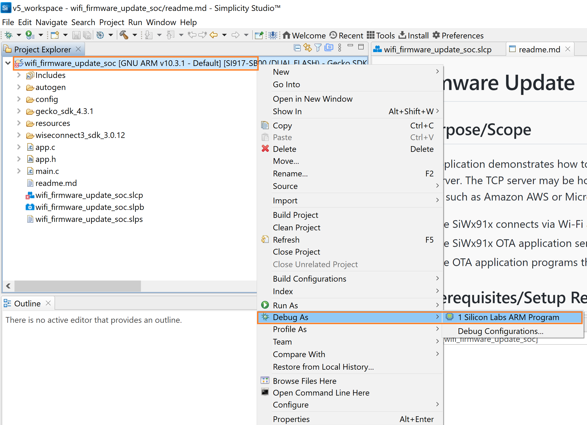

  - NCP

    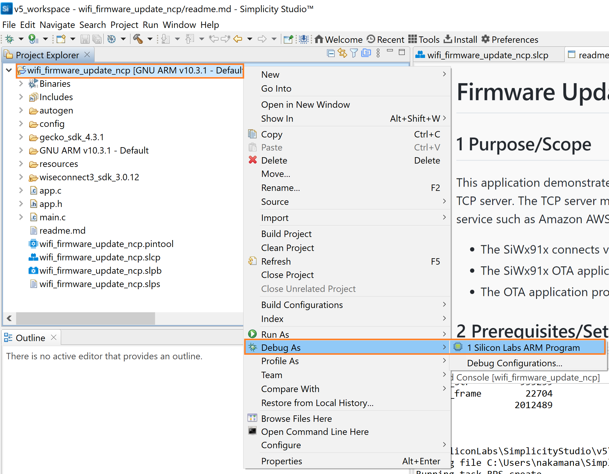

When the application runs and connects to the TCP server, the firmware image transfer occurs in chunks. The app requests a firmware chunk, the server sends the chunk, the app requests the next chunk, the server sends the chunk, and so forth until the entire transfer completes. As the transfer proceeds, progress is printed to the serial console. On completion, the console prints 'reach end of file'.

### 4.4 Application Output

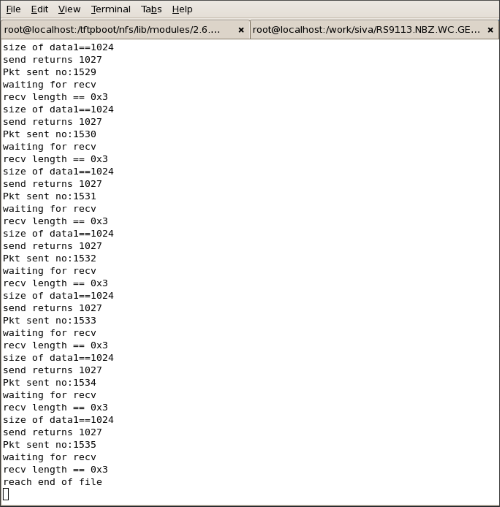


When the firmware update completes, the SiWx91x should be rebooted after which it may take a few minutes to overwrite the old firmware with the new firmware in flash memory.

### Note

For NCP mode, following defines have to enabled manually in preprocessor setting of example project

- For 917A0 expansion board, enable CHIP_917 = 1
- For 917B0 1.2 expansion board, enable CHIP_917 = 1, CHIP_917B0 = 1
- For 917B0 2.0 expansion board, enable CHIP_917 = 1, CHIP_917B0 = 1, SI917_RADIO_BOARD_V2 = 1 (This is enabled by default for all examples)